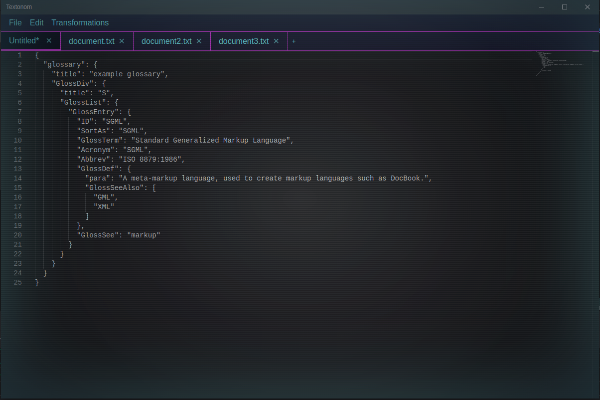

[](https://join.slack.com/t/netroforge/shared_invite/zt-335byot5g-Z6PVCx45OgKKiTjJxz7odw)

# textonom

A text editor that lets you perform common text transformations locally.
Helps make your sensitive data safe.



## Supported Transformations

Textonom supports the following text transformation operations:

### Encoding & Decoding

_Encode or decode text using various algorithms_

- **Base64 Encode**: Encode text to Base64 format
- **Base64 Decode**: Decode Base64 encoded text
- **URL Encode**: Encode text for use in URLs
- **URL Decode**: Decode URL encoded text
- **HTML Encode**: Encode special characters for HTML
- **HTML Decode**: Decode HTML entities to characters
- **Unicode Escape**: Escape Unicode characters to \uXXXX format
- **Unicode Unescape**: Convert \uXXXX format to actual Unicode characters

### Formatting

_Format and prettify various data formats_

- **JSON Prettify**: Format JSON with proper indentation
- **JSON Compact**: Compact JSON by removing whitespace
- **XML Prettify**: Format XML with proper indentation
- **XML Compact**: Compact XML by removing whitespace

### Case Conversion

_Convert text case (uppercase, lowercase, etc.)_

- **To Uppercase**: Convert text to uppercase
- **To Lowercase**: Convert text to lowercase
- **To Title Case**: Convert text to title case (first letter of each word capitalized)

### Text Operations

_Various text manipulation operations_

- **Sort Lines**: Sort lines alphabetically
- **Deduplicate Lines**: Remove duplicate lines
- **Reverse Lines**: Reverse the order of lines

### Hashing

_Generate cryptographic hashes_

- **MD5 Hash**: Generate MD5 hash of text
- **SHA-1 Hash**: Generate SHA-1 hash of text
- **SHA-256 Hash**: Generate SHA-256 hash of text
- **Bcrypt Hash**: Generate Bcrypt hash of text (with configurable rounds)

### Format Conversion

_Convert between different data formats_

- **JSON to YAML**: Convert JSON to YAML format
- **YAML to JSON**: Convert YAML to JSON format
- **Properties to YAML**: Convert Java properties file to YAML
- **YAML to Properties**: Convert YAML to Java properties file format

## Project Setup

### Install

```shell
$ npm install
```

### Development

```shell
$ npm run dev
```

### Build

For Windows

```shell
$ npm run build:win
```

For Mac

```shell
$ npm run build:mac
```

For Linux

```shell
$ npm run build:linux
```

### Snapcraft

https://snapcraft.io/docs/releasing-your-app

```shell
snapcraft login
```
