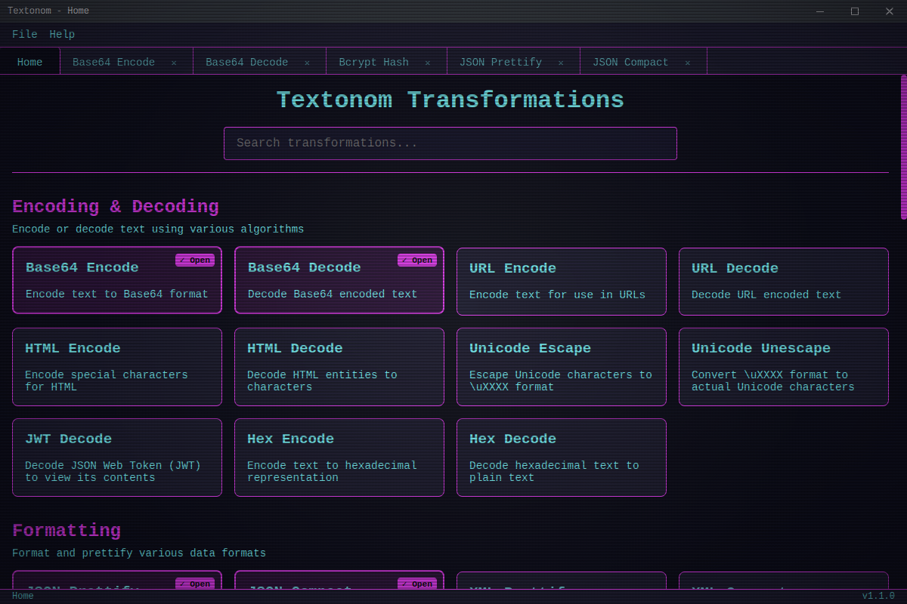

[](https://join.slack.com/t/netroforge/shared_invite/zt-335byot5g-Z6PVCx45OgKKiTjJxz7odw)

# Textonom

A text editor that lets you perform common text transformations locally.
Helps make your sensitive data safe.



<!-- TOC -->

- [Textonom](#textonom)
  - [Technology](#technology)
  - [Supported Transformations](#supported-transformations)
    - [Encoding & Decoding](#encoding--decoding)
    - [Formatting](#formatting)
    - [Case Conversion](#case-conversion)
    - [Text Operations](#text-operations)
    - [Hashing](#hashing)
    - [Format Conversion](#format-conversion)
  - [Features](#features)
    - [User Interface](#user-interface)
    - [Security & Privacy](#security--privacy)
    - [Updates](#updates)
  - [Project Setup](#project-setup)
    - [Install](#install)
    - [Development](#development)
    - [Build](#build)
    - [Publishing](#publishing)
  - [Contributing](#contributing)
  - [License](#license)
  - [Misc](#misc) \* [Snapcraft](#snapcraft)
  <!-- TOC -->

## Technology

Textonom is built with:

- **Electron**: Cross-platform desktop application framework (v35.x.x)
- **React**: UI library for building the user interface (v19.x.x)
- **TypeScript**: Type-safe JavaScript (v5.x.x)
- **Zustand**: State management
- **electron-updater**: Auto-update functionality
- **CSS**: Styling with custom themes (light, dark and cyberpunk)

## Supported Transformations

Textonom supports the following text transformation operations:

### Encoding & Decoding

_Encode or decode text using various algorithms_

- **Base64 Encode**: Encode text to Base64 format
- **Base64 Decode**: Decode Base64 encoded text
- **URL Encode**: Encode text for use in URLs
- **URL Decode**: Decode URL encoded text
- **HTML Encode**: Encode special characters for HTML
- **HTML Decode**: Decode HTML entities to characters
- **Unicode Escape**: Escape Unicode characters to \uXXXX format
- **Unicode Unescape**: Convert \uXXXX format to actual Unicode characters
- **Hex Encode**: Convert text to hexadecimal representation
- **Hex Decode**: Convert hexadecimal back to text
- **JWT Decode**: Decode and display JWT token contents

### Formatting

_Format and prettify various data formats_

- **JSON Prettify**: Format JSON with proper indentation
- **JSON Compact**: Compact JSON by removing whitespace
- **XML Prettify**: Format XML with proper indentation
- **XML Compact**: Compact XML by removing whitespace
- **SQL Format**: Format SQL queries with proper indentation
- **HTML Format**: Format HTML with proper indentation
- **CSS Format**: Format CSS with proper indentation
- **JavaScript Format**: Format JavaScript with proper indentation
- **XML Format**: Format XML with proper indentation

### Case Conversion

_Convert text case (uppercase, lowercase, etc.)_

- **To Uppercase**: Convert text to uppercase
- **To Lowercase**: Convert text to lowercase
- **To Title Case**: Convert text to title case (first letter of each word capitalized)
- **To Snake Case**: Convert text to snake_case
- **To Camel Case**: Convert text to camelCase
- **To Kebab Case**: Convert text to kebab-case

### Text Operations

_Various text manipulation operations_

- **Sort Lines**: Sort lines alphabetically
- **Deduplicate Lines**: Remove duplicate lines
- **Reverse Lines**: Reverse the order of lines
- **Remove Empty Lines**: Remove all empty lines from text
- **Remove Duplicate Words**: Remove duplicate words from text

### Hashing

_Generate cryptographic hashes_

- **MD5 Hash**: Generate MD5 hash of text
- **SHA-1 Hash**: Generate SHA-1 hash of text
- **SHA-256 Hash**: Generate SHA-256 hash of text
- **SHA-512 Hash**: Generate SHA-512 hash of text
- **HMAC Hash**: Generate HMAC hash with custom key
- **Bcrypt Hash**: Generate Bcrypt hash of text (with configurable rounds)
- **Argon2 Hash**: Generate Argon2 hash

### Format Conversion

_Convert between different data formats_

- **JSON to YAML**: Convert JSON to YAML format
- **YAML to JSON**: Convert YAML to JSON format
- **Properties to YAML**: Convert Java properties file to YAML
- **YAML to Properties**: Convert YAML to Java properties file format
- **CSV to JSON**: Convert CSV to JSON format
- **JSON to CSV**: Convert JSON to CSV format
- **Markdown to HTML**: Convert Markdown to HTML

## Features

### User Interface

- **Tab-based Interface**: Open multiple transformations in tabs
- **Draggable Tabs**: Rearrange tabs as needed
- **Home Page**: Quick access to all transformations with search functionality
- **Multiple Themes**: Choose between Light, Dark, and Cyberpunk themes
- **Turbo Mode**: Optional CRT effects for a retro experience
- **Settings**: Customize font size, font family, word wrap, and more

### Security & Privacy

- **Local Processing**: All transformations are performed locally on your device
- **No Data Transmission**: Your sensitive data never leaves your computer
- **Open Source**: Transparent codebase that can be audited

### Updates

- **Auto-Update**: Automatically check for and install updates
- **Manual Update Check**: Check for updates on demand
- **Update Notifications**: Non-intrusive update notifications

## Project Setup

### Install

```shell
$ npm install
```

### Development

```shell
$ npm run dev
```

### Build

For Windows

```shell
$ npm run build:win
```

For Mac

```shell
$ npm run build:mac
```

For Linux

```shell
$ npm run build:linux
```

### Publishing

For Windows

```shell
$ npm run publish:win
```

For Mac

```shell
$ npm run publish:mac
```

For Linux

```shell
$ npm run publish:linux
```

## Contributing

Contributions are welcome! Feel free to open issues or submit pull requests.

1. Fork the repository
2. Create your feature branch (`git checkout -b feature/amazing-feature`)
3. Commit your changes (`git commit -m 'Add some amazing feature'`)
4. Push to the branch (`git push origin feature/amazing-feature`)
5. Open a Pull Request

Join our [Slack channel](https://join.slack.com/t/netroforge/shared_invite/zt-335byot5g-Z6PVCx45OgKKiTjJxz7odw) for discussions.

## License

This project is licensed under the MIT License - see the LICENSE file for details.

## Misc

### Snapcraft

https://snapcraft.io/docs/releasing-your-app

```shell
snapcraft login
```

# Misc
